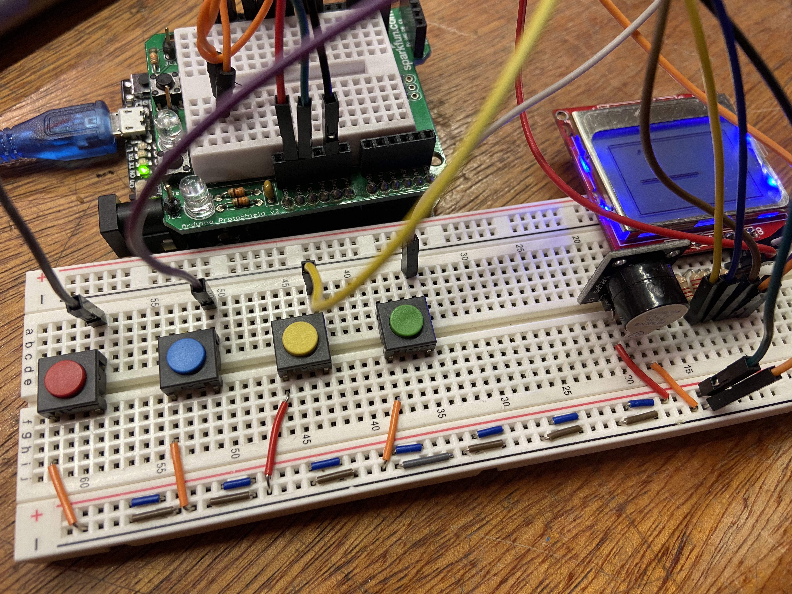

# Serpentia-Snake-Game-Run-on-Arduino
coming

**If you'd like to experiment with the prototype, you can interact with the design using this interactive [wokwi sketch](https://wokwi.com/projects/394153136625249281).**

  

  Breadboard Prototype with Arduino Uno (clone with Hat).

